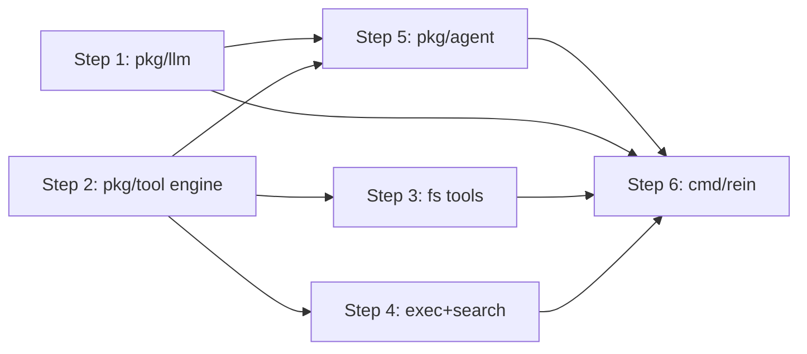

# Rein — Agent Core (A.1 Agentic Loop / A.2 Tool Engine)

Main plan. Sub-plans:
- [Step 1](./20260626142129_NO-JIRA_PLAN_agent-core-STEP-1.md) — `pkg/llm` OpenAI 호환 클라이언트
- [Step 2](./20260626142129_NO-JIRA_PLAN_agent-core-STEP-2.md) — `pkg/tool` 엔진 + 출력 cap 헬퍼
- [Step 3](./20260626142129_NO-JIRA_PLAN_agent-core-STEP-3.md) — fs 도구(`read_file`/`write_file`/`edit_file`)
- [Step 4](./20260626142129_NO-JIRA_PLAN_agent-core-STEP-4.md) — exec+search 도구(`bash`/`grep`/`glob`)
- [Step 5](./20260626142129_NO-JIRA_PLAN_agent-core-STEP-5.md) — `pkg/agent` 동기 루프
- [Step 6](./20260626142129_NO-JIRA_PLAN_agent-core-STEP-6.md) — `cmd/rein` 와이어링(단발 실행)

Related research: 없음(스캐폴드 전용 레포라 코드 조사 불필요).

## Goal

SPEC의 **A.1 Agentic Loop**와 **A.2 Tool 실행 엔진 + 6개 기본 도구**를 단일 Go 바이너리 CLI로 구현한다. `pkg/llm`(OpenAI 호환 client) → `pkg/tool`(registry + 출력 cap + 6 도구) → `pkg/agent`(동기 request-response 루프) → `cmd/rein`(단발 실행 진입점) 순서로 쌓으며, 각 스텝 완료 시점에 프로젝트가 컴파일되고 테스트가 통과하는 증분 개발을 따른다. A.3(시스템 프롬프트 조립)·A.4(컨텍스트 관리)·B(harness)는 후속 스펙으로 분리한다.

## Architecture Overview

단일 Go 프로세스, 서버/포트 없음. 동기 루프 — 매 turn마다 LLM에 1회 non-streaming POST하고 완성된 `tool_calls`를 순서대로 실행한다. 상태는 인메모리 `[]llm.Message` append-only.

패키지 의존 방향:

```
pkg/llm   (독립)  ─┐
                   ├─▶ pkg/agent ─▶ cmd/rein
pkg/tool  (독립)  ─┘        ▲           │
                            └───────────┘ (registry 주입)
```

- `pkg/llm`: OpenAI 호환 타입 + `Client` 인터페이스 + `net/http` 구현. 다른 내부 패키지에 의존하지 않는다.
- `pkg/tool`: `Tool` 인터페이스 + `Registry` + 출력 cap 헬퍼 + 6개 도구. `pkg/llm`에 의존하지 않는다(도구 정의를 OpenAI 포맷으로 래핑하는 책임은 `pkg/agent`가 가진다).
- `pkg/agent`: `pkg/llm`과 `pkg/tool`을 엮는 루프.
- `cmd/rein`: env 로딩, registry 부팅(6도구 등록), client·agent 구성, 단발 실행.



## Tech Stack

- **Go** 1.26.x, 단일 바이너리 CLI.
- **LLM 연동**: `net/http` 직접 구현, OpenAI Chat Completions 호환 엔드포인트(`/v1/chat/completions`), function tool-calling.
- **Logging**: `log/slog`(stderr).
- **Testing**: 표준 `testing`, table-driven, `httptest`/hand-rolled fake.
- **시스템 바이너리**: ripgrep(`rg`), fd.
- 코어 의존 최소화: `net/http` + `encoding/json` + `os/exec` + `context` + `log/slog`. 외부 프레임워크(langchaingo 등) 미사용.

## Conventions

- **에러 컨벤션**: `docs/go-conventions.md` 기준을 따른다 — exported sentinel `var ErrX = errors.New("...")`을 사용하는 파일 상단에 선언, **각 sentinel은 정확히 1회 call site에서만 사용**, 래핑은 `errors.Join(ErrX, err)`로 한다. 이번 작업에서 `CLAUDE.md:36`, `AGENTS.md:36`, `docs/SPEC.md:59`의 `fmt.Errorf("...%w")` 예시를 이 기준에 맞게 수정한다(기존 섹션 구조는 유지, 내용만 정정).
- **도구 실패는 루프를 죽이지 않는다**: 도구 에러는 Go error로 전파해 루프를 중단하는 대신 `role:"tool"` 메시지 content에 에러 문자열로 담아 모델에 반환(자기수정 유도). 네트워크·시스템 치명 오류만 루프 중단.
- **도구 출력 캡**: 모든 도구 출력은 ~50KB / 2000라인 상한. 초과 시 중간 절단하고 전체 내용은 temp-file로 오프로드 후 그 경로를 출력에 안내.
- **temp-file 정책**: `os.MkdirTemp("", "rein-*")`(OS 기본 temp 디렉터리)에 저장하고 자동 정리하지 않는다(OS 주기 정리에 위임). 모델이 경로로 재접근할 수 있다.
- **Tool 인터페이스(확정)**: `Name() string` / `Schema() json.RawMessage` / `Execute(ctx context.Context, args json.RawMessage) (string, error)`. `Schema()`는 OpenAI function 객체의 inner(`{"name","description","parameters"}`)를 반환하고, `pkg/agent`가 `{"type":"function","function": <schema>}`로 래핑한다.
- **순차 실행**: 한 응답에 여러 `tool_calls`가 오면 배열 순서대로 순차 실행한다.
- **slog 관측**: turn 번호, tool 호출명/소요/결과 길이를 stderr 구조적 로그로 출력한다.
- **테스트 패키지**: 외부 `{pkg}_test` 패키지에서 exported API만 검증한다(`docs/go-conventions.md`).
- **Config(env)**: `OPENAI_BASE_URL`, `OPENAI_API_KEY`, `OPENAI_MODEL`.

## Requirements Coverage

| Requirement | Description | Implemented In |
|-------------|-------------|----------------|
| FR-1 | Agentic Loop (A.1) | Step 1(LLM 전송·재시도), Step 5(루프 제어) |
| FR-2 | Tool 실행 엔진 + 최소 도구 세트 (A.2) | Step 2(엔진+cap), Step 3(fs 3종), Step 4(exec+search 3종) |
| 통합 | env 로딩·와이어링·단발 실행 | Step 6 |

## Steps Overview

| Step | Title | Description | Depends On |
|------|-------|-------------|------------|
| 1 | `pkg/llm` 클라이언트 | OpenAI 호환 타입 + `Client` 인터페이스 + `net/http` 구현 + 지수 백오프 5회 재시도 | None |
| 2 | `pkg/tool` 엔진 | `Tool` 인터페이스 + `Registry` + 출력 cap(50KB/2000라인)·temp 오프로드 헬퍼 | None |
| 3 | fs 도구 | `read_file`/`write_file`/`edit_file`(unique-match) | Step 2 |
| 4 | exec+search 도구 | `bash`(cwd 고정·300s) / `grep`(rg) / `glob`(fd), 절대경로 resolve | Step 2 |
| 5 | `pkg/agent` 루프 | 동기 루프, max_turns=50, 순차 tool 실행, slog 관측 | Step 1, Step 2 |
| 6 | `cmd/rein` 와이어링 | env 로딩, 6도구 등록, 단발 실행, stderr slog | Step 1–5 |

## Execution Flow

- **Phase 1 (병렬)**: Step 1, Step 2 — 둘 다 의존 없음.
- **Phase 2 (병렬)**: Step 3, Step 4(둘 다 Step 2 의존), Step 5(Step 1·2 의존).
- **Phase 3**: Step 6 — 전체 의존.

## Cross-checks

- 스텝 1~N만 완료해도 프로젝트가 컴파일되고 테스트가 통과한다(각 스텝은 독립 패키지 또는 fake 기반 단위 테스트로 닫힌다).
- 모든 FR이 최소 1개 스텝에 등장한다(위 Requirements Coverage 참고).
- 메인 플랜의 모든 서브플랜 링크가 실제 파일명과 일치한다.
- 참고: `make test`는 설명상 race/coverage를 명시하지만 실제 명령엔 `-race`/`-cover`가 빠진 기존 불일치가 있다. 이번 범위 밖이며 **선택적 보정**으로만 남긴다(요청 시 별도 처리).

## Sub-plans

- [Step 1](./20260626142129_NO-JIRA_PLAN_agent-core-STEP-1.md) — `pkg/llm` OpenAI 호환 클라이언트
- [Step 2](./20260626142129_NO-JIRA_PLAN_agent-core-STEP-2.md) — `pkg/tool` 엔진 + 출력 cap 헬퍼
- [Step 3](./20260626142129_NO-JIRA_PLAN_agent-core-STEP-3.md) — fs 도구
- [Step 4](./20260626142129_NO-JIRA_PLAN_agent-core-STEP-4.md) — exec+search 도구
- [Step 5](./20260626142129_NO-JIRA_PLAN_agent-core-STEP-5.md) — `pkg/agent` 동기 루프
- [Step 6](./20260626142129_NO-JIRA_PLAN_agent-core-STEP-6.md) — `cmd/rein` 와이어링
